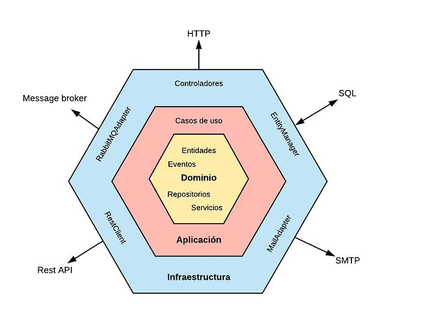

La Arquitectura Hexagonal propone que nuestro dominio sea el núcleo de las capas y que este no se acople a nada externo. En lugar de hacer uso explícito y mediante el principio de inversión de dependencias nos acoplamos a contratos (interfaces o puertos) y no a implementaciones concretas.
Definiendo puertos o puntos de entrada e interfaces (adaptadores) para que otros módulos (UI, BBDD, Test) puedan implementarlas y comunicarse con la capa de negocio sin que ésta deba saber el origen de la conexión.

Esto es lo llamado puertos y adaptadores, que podrían ser definidos de la siguiente manera:

* Port: definición de una interfaz pública.
* Adapter: especialización de un puerto para un contexto concreto.
